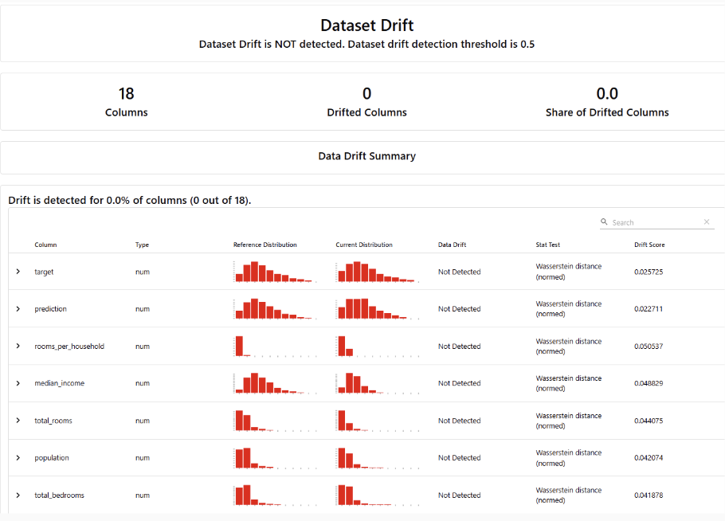

# mlops_final_project

## Setup

This repository uses Azure Databricks and Apache Airflow to orchestrate data pipelines. Orchestration in Databricks can be done programmatically or through the user interface. For this project, we utilized the in-console approach for orchestration.

### Approaches to Orchestration

#### Programmatic Orchestration
- Involves defining workflows as directed acyclic graphs (DAGs) using Python.
- DAGs are executed and scheduled by Airflow, leveraging its rich scheduling features.
- Offers fine-grained control over tasks, dependencies, and execution through the `DatabricksRunNowOperator` and `DatabricksSubmitRunOperator`.
- Requires installation of the `apache-airflow-providers-databricks` package for integration.

#### In-Console Orchestration
- Provides a user-friendly interface for defining workflows directly within Azure Databricks.
- Allows tasks to be managed through the Databricks Jobs UI, reducing the need for coding complex dependencies.
- Simplifies monitoring and debugging by offering visual feedback on job runs and statuses.
- Ideal for projects where quick setup and minimal configuration are priorities.

For this pipeline, we leveraged the in-console orchestration approach for ease of use and efficiency in managing complex dependencies and scheduling tasks. More can be read about this here: https://learn.microsoft.com/en-us/azure/databricks/jobs/how-to/use-airflow-with-jobs

## Pipeline Notebooks

This section provides an overview of each notebook in the pipeline and its role in the data processing and modeling workflow.

### 1. Data Import
**Notebook:** `FinalProject_data_import.ipynb`  
**Description:** Loads raw data into the pipeline, preparing it for subsequent preprocessing and feature engineering.

### 2. Feature Engineering
**Notebook:** `FinalProject_feature_engineering.ipynb`  
**Description:** Performs data cleanup and feature engineering to transform raw data into a format suitable for modeling.

### 3. Baseline Model
**Notebook:** `FinalProject_find_baseline_model.ipynb`  
**Description:** Uses AutoML to produce a baseline model, providing a benchmark for evaluating subsequent models.

### 4. Hyperparameter Tuning
**Notebook:** `FinalProject_hyperparameter_tuning.ipynb`  
**Description:** Tunes hyperparameters of the chosen model to optimize performance.

### 5. Model Training
**Notebook:** `FinalProject_training.ipynb`  
**Description:** Trains the final model on the prepared dataset using the best hyperparameters.

### 6. Model Testing and Monitoring
**Notebook:** `FinalProject_model_testing_monitoring.ipynb`  
**Description:** Loads the registered model, runs inference on test data, and monitors model performance for deployment readiness.

## Results

### Introduction
The project aimed to implement an end-to-end machine learning pipeline to predict median housing prices in California districts based on the 1990 Census data. Key tools included Python, Databricks, AWS, MLflow, and EvidentlyAI

---

### Exploratory Data Analysis (EDA)
The dataset contained ~20,000 observations, each representing a housing block group in California. Features like median income and house value served as important predictors.

Geographic analysis revealed housing value clusters in regions like the SF Bay Area, LA, and Lake Tahoe, emphasizing the significance of geographic features.  

---

### Pipeline Overview
The pipeline followed a systematic workflow:
1. Data ingestion and cleaning.
2. Baseline model creation using AutoML.
3. Model improvement via feature engineering and hyperparameter tuning.
4. Model evaluation and deployment.
5. Continuous monitoring using EvidentlyAI.

---

### Algorithm Selection
Databricks AutoML identified XGBoost as the ideal algorithm based on RMSE and MAPE metrics:
- Validation RMSE: $41,983
- Validation MAPE: 16.5%.

---

### Model Improvement
Feature engineering introduced new predictors like "rooms per household" and "population per household." Hyperparameter tuning using HyperOpt reduced:
- Validation RMSE to $38,939

---

### Model Monitoring
The model was deployed for batch inference, achieving consistent predictions for test data. EvidentlyAI detected no drift in clean test data but identified issues when features were modified.

**Clean Dataset Results:**  

**Dirty Dataset Results:**  

---

### SHAP Analysis
SHAP analysis highlighted latitude and longitude as critical features, with custom-engineered features ranking among the top predictors.

* Geographic features are among the most important (latitude = 1st, longitude = 3rd)
* Three of our custom features were in the top 7
Population_per_household:
* Districts with fewer people per house generally have a higher median house value

---

## Predictions
The predictions closely aligned with the actual target values, demonstrating high model accuracy.  

---

### Future Work
Future plans include:
1. Using Databricks Feature Store for improved performance.
2. Implementing real-time inference.
3. Expanding the pipeline to other datasets.

---
